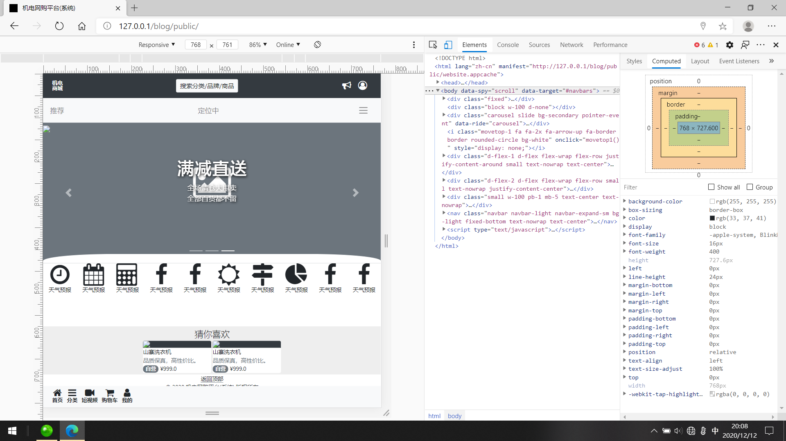

# GdmecMallSys

 
机电网购平台（系统） 

#### 集成环境

| 编辑器 | 版本 | 平台 |
| :-: | :-: | :-: |
| Creative Cloud | v5.1.0.407 | Windows |
| Dreamweaver CC | v18.2 | Windows |
| Zend Studio | v13.6.1 | Windows x64 |
| phpStudy 2018 | v2018 | Windows |
| MySQL-Front | v5.3 | Windows |

#### 重要技术

> _bootstrap_  
> 利用 Bootstrap 构建快速、响应式的网站，具体情况：
- Bootstrap 是全球最受欢迎的前端开源工具库，它支持 Sass 变量和 mixin、响应式栅格系统、自带大量组件和众多强大的 JavaScript 插件
- 基于 Bootstrap 提供的强大功能，能够让你快速设计并自定义你的网站
> _laravel_  
> 为 WEB 艺术家创造的 PHP 框架（渐进式框架 可扩展框架 社区框架）：
- Laravel是一套web应用开发框架，它具有富于表达性且简洁的语法。我们相信，开发过程应该是愉悦、创造性的体验。Laravel努力剔除开发过程中的痛苦，因此我们提供了验证（authentication）、路由（routing）、session和缓存（caching）等开发过程中经常用到的工具或功能。
- Laravel的目标是给开发者创造一个愉快的开发过程，并且不牺牲应用的功能性。快乐的开发者才能创造最棒的代码！为了这个目的，我们博取众框架之长处集中到Laravel中，这些框架甚至是基于Ruby on Rails、ASP.NET MVC、和Sinatra等开发语言或工具的。
- Laravel是易于理解并且强大的，它提供了强大的工具用以开发大型、健壮的应用。杰出的IoC、数据库迁移工具和紧密集成的单元测试支持，这些工具赋予你构建任何应用的能力。

#### [简介 · Bootstrap v4.5](https://v4.bootcss.com/docs/getting-started/introduction/)
#### [《Laravel 6 中文文档》| Laravel China 社区](https://learnku.com/docs/laravel/6.x)

#### 软件架构

├─LICENSE `许可证`
***

#### 运行结果

