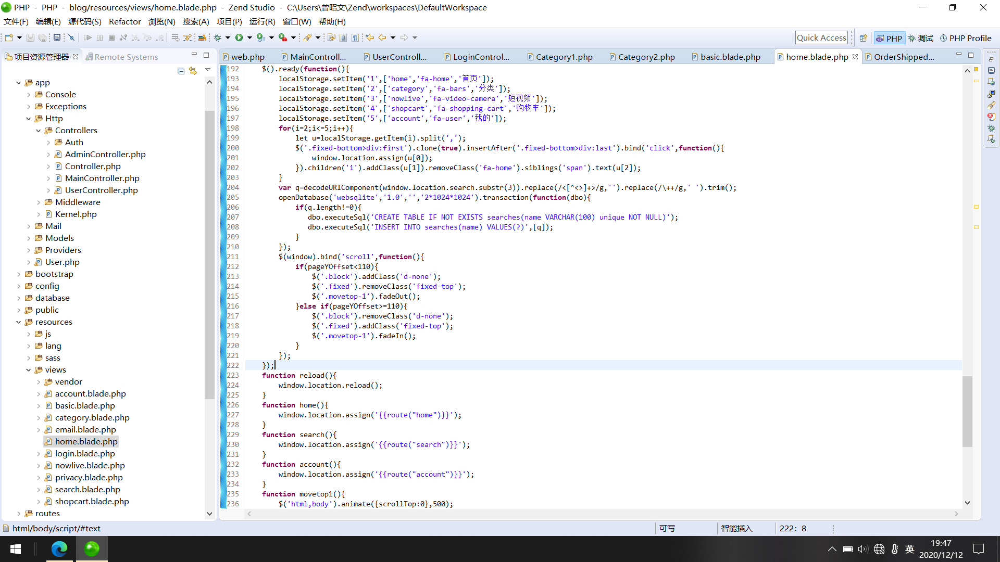
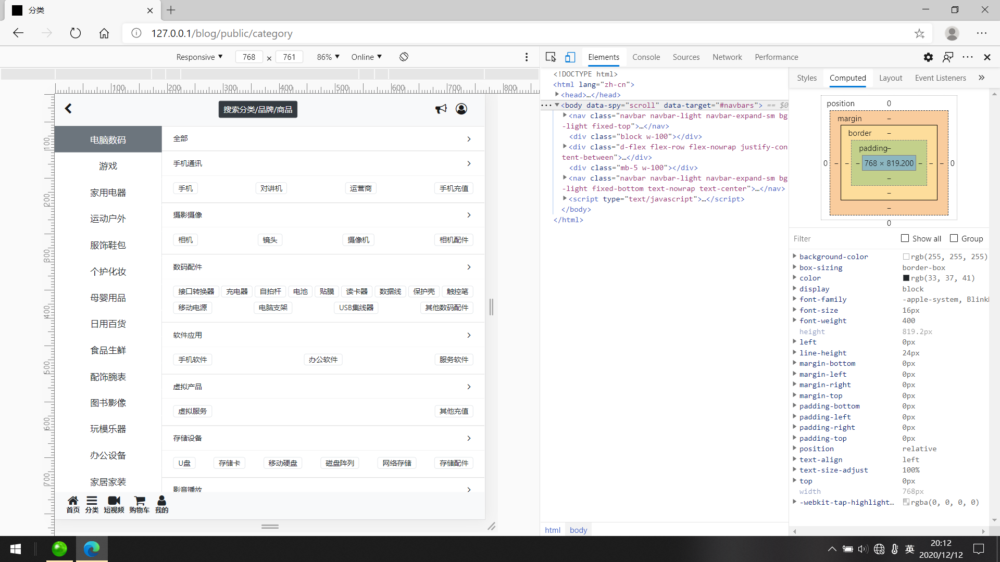
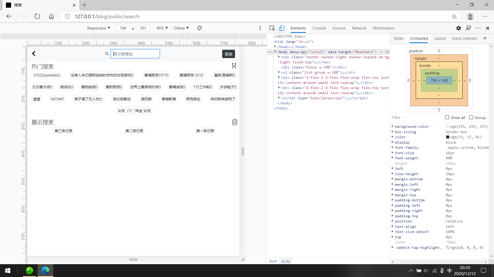
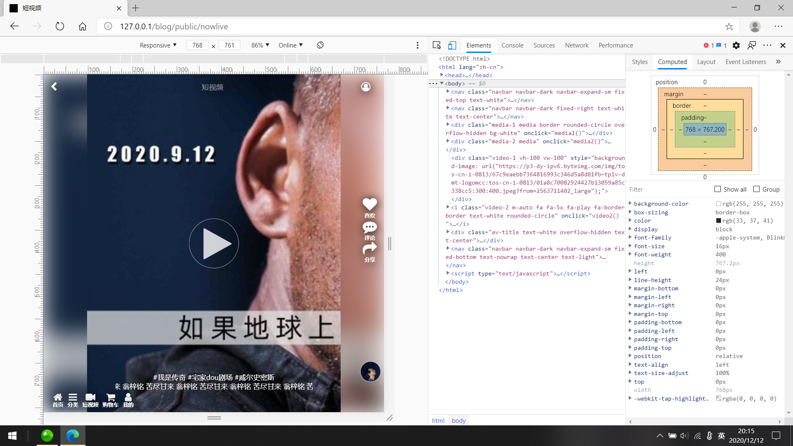
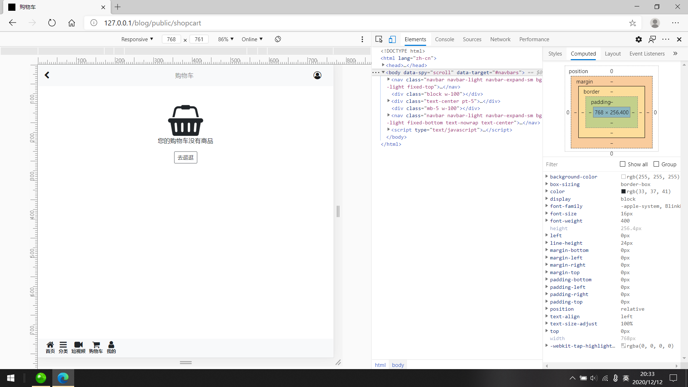
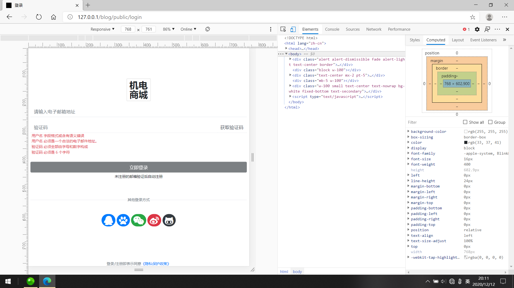
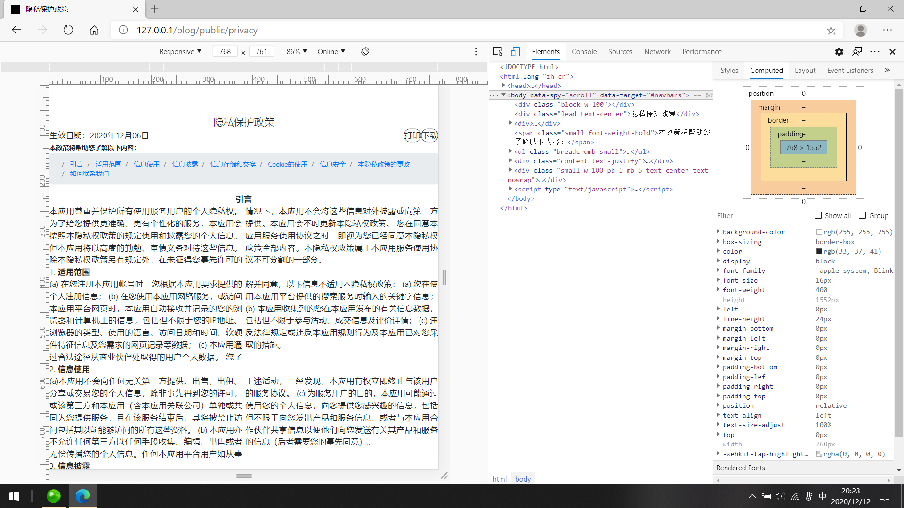
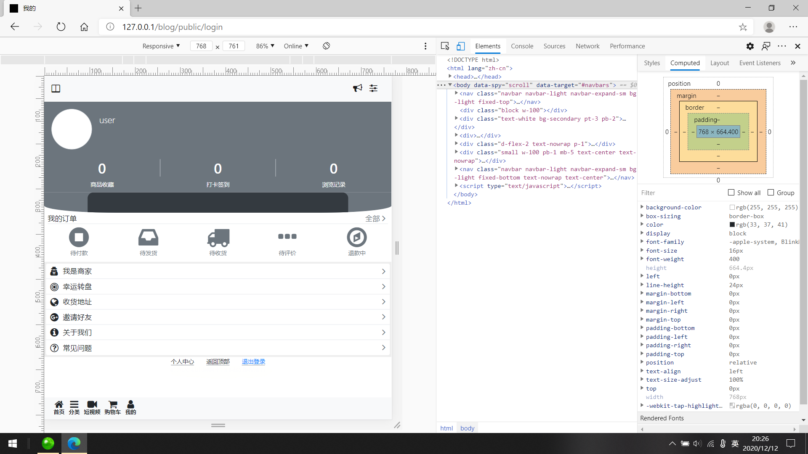

# GdmecMallSys

 
机电网购平台（系统） 

#### 集成环境

| 编辑器 | 版本 | 平台 |
| :-: | :-: | :-: |
| Creative Cloud | v5.1.0.407 | Windows |
| Dreamweaver CC | v18.2 | Windows |
| Zend Studio | v13.6.1 | Windows x64 |
| phpStudy 2018 | v2018 | Windows |
| MySQL-Front | v5.3 | Windows |

#### 重要技术

> _bootstrap_  
> 利用 Bootstrap 构建快速、响应式的网站，具体情况：
- Bootstrap 是全球最受欢迎的前端开源工具库，它支持 Sass 变量和 mixin、响应式栅格系统、自带大量组件和众多强大的 JavaScript 插件
- 基于 Bootstrap 提供的强大功能，能够让你快速设计并自定义你的网站
> _laravel_  
> 为 WEB 艺术家创造的 PHP 框架（渐进式框架 可扩展框架 社区框架）：
- Laravel是一套web应用开发框架，它具有富于表达性且简洁的语法。我们相信，开发过程应该是愉悦、创造性的体验。Laravel努力剔除开发过程中的痛苦，因此我们提供了验证（authentication）、路由（routing）、session和缓存（caching）等开发过程中经常用到的工具或功能。
- Laravel的目标是给开发者创造一个愉快的开发过程，并且不牺牲应用的功能性。快乐的开发者才能创造最棒的代码！为了这个目的，我们博取众框架之长处集中到Laravel中，这些框架甚至是基于Ruby on Rails、ASP.NET MVC、和Sinatra等开发语言或工具的。
- Laravel是易于理解并且强大的，它提供了强大的工具用以开发大型、健壮的应用。杰出的IoC、数据库迁移工具和紧密集成的单元测试支持，这些工具赋予你构建任何应用的能力。

#### [简介 · Bootstrap v4.5](https://v4.bootcss.com/docs/getting-started/introduction/)
#### [《Laravel 6 中文文档》| Laravel China 社区](https://learnku.com/docs/laravel/6.x)

#### 软件架构

├─LICENSE `许可证`
***
├─.buildpath `构建路径`
├─.editorconfig `编辑器配置`
├─.env `环境`
├─.env.example `环境示例`
├─.project `项目`
├─.styleci.yml `样式修复`
├─artisan `Laravel工具`
├─composer.json `依赖项工具`
├─composer.lock `依赖项工具`
├─package.json `模块工具`
├─webpack.mix.js `模块打包`
├─phpunit.xml `单元测试`
├─server.php `服务器内置`
├─tests `测试`
|   ├─CreatesApplication.php `创建`
|   ├─TestCase.php `测试用例`
|   ├─Unit `单元`
|   |  └ExampleTest.php
|   ├─Feature `特性`
|   |    └ExampleTest.php
├─storage `文件存储`
|    ├─logs `日志`
|    |  └...
|    ├─framework `框架`
|    |     ├─testing `测试`
|    |     ├─cache `缓存`
|    |     |   ├─data `数据`
|    |     |   └...
|    |     ├─sessions `闪存`
|    |     |   └...
|    |     ├─views `视图`
|    |     |   └...
|    ├─app `主程序`
|    |  ├─public `公用资源`
|    |  |   ├─category1s.sql `分类表1`
|    |  |   ├─category2s.sql `分类表2`
|    |  |   └privacys.txt `隐私保护政策文本`
├─routes `路由`
|   ├─api.php `接口`
|   ├─channels.php `频道`
|   ├─console.php `命令`
|   └web.php `页面`
├─resources `资产`
|     ├─views `视图模板`
|     |   ├─vendor `依赖工具库`
|     |    | ├─mail `邮件`
|     |    |  |   ├─html `HTML(文本)`
||||  |  ├─button.blade.php
||||  |  ├─footer.blade.php
||||  |  ├─header.blade.php
||||  |  ├─layout.blade.php
||||  |  ├─message.blade.php
||||  |  ├─panel.blade.php
||||  |  ├─promotion.blade.php
||||  |  ├─subcopy.blade.php
||||  |  ├─table.blade.php
||||  |  ├─themes
||||  |  |   └default.css
||||  |  ├─promotion
||||  |  |     └button.blade.php
|     |    |  |   ├─text `Text(文本)`
||||  |  ├─button.blade.php
||||  |  ├─footer.blade.php
||||  |  ├─header.blade.php
||||  |  ├─layout.blade.php
||||  |  ├─message.blade.php
||||  |  ├─panel.blade.php
||||  |  ├─promotion.blade.php
||||  |  ├─subcopy.blade.php
||||  |  ├─table.blade.php
||||  |  ├─promotion
||||  |  |     └button.blade.php
|     |   ├─account.blade.php `我的`
|     |   ├─basic.blade.php `父页`
|     |   ├─category.blade.php `分类`
|     |   ├─email.blade.php `邮件`
|     |   ├─home.blade.php `主页`
|     |   ├─login.blade.php `登录`
|     |   ├─nowlive.blade.php `短视频`
|     |   ├─privacy.blade.php `隐私保护政策`
|     |   ├─search.blade.php `搜索`
|     |   └shopcart.blade.php `购物车`
|     ├─sass `SASs(脚本)`
|     |  └app.scss
|     ├─lang `语言`
|     |  ├─zh_cn `中文`
|     |  |   ├─auth.php
|     |  |   ├─pagination.php
|     |  |   ├─passwords.php
|     |  |   └validation.php
|     |  ├─en `英文`
|     |  | ├─auth.php
|     |  | ├─pagination.php
|     |  | ├─passwords.php
|     |  | └validation.php
|     ├─js `JavaScript(脚本)`
|     | ├─app.js
|     | └bootstrap.js
├─public `公用资源`
|   ├─.htaccess `受限访问`
|   ├─favicon.ico `网站图标`
|   ├─index.php `页面入口`
|   ├─robots.txt `受限抓取`
|   ├─storage `文件存储`
|   ├─web.config `配置`
|   ├─website.appcache `缓存`
|   ├─_notes
|   |   └...
|   ├─ui `JavaScript(脚本)`
|   | ├─alert.js
|   | ├─bootstrap.bundle.js
|   | ├─bootstrap.js
|   | ├─button.js
|   | ├─carousel.js
|   | ├─collapse.js
|   | ├─dropdown.js
|   | ├─html5shiv.js
|   | ├─index.js
|   | ├─jquery.jqzoom.js
|   | ├─jquery.js
|   | ├─modal.js
|   | ├─popover.js
|   | ├─popper.js
|   | ├─respond.js
|   | ├─scrollspy.js
|   | ├─tab.js
|   | ├─toast.js
|   | ├─tooltip.js
|   | └util.js
|   ├─img `图像`
|   |  └welcome.png
|   ├─fonts `字体`
|   |   ├─fontawesome-webfont.eot
|   |   ├─fontawesome-webfont.svg
|   |   ├─fontawesome-webfont.ttf
|   |   ├─fontawesome-webfont.woff
|   |   ├─fontawesome-webfont.woff2
|   |   └FontAwesome.otf
|   ├─font `字体`
|   |  ├─Apple Color Emoji.ttc
|   |  ├─Apple Symbols.ttf
|   |  ├─Hiragino Sans GB W3.ttc
|   |  ├─Hiragino Sans GB W6.ttc
|   |  ├─Microsoft-YaHei-Semibold.ttc
|   |  ├─Microsoft-YaHei-Semilight.ttc
|   |  └PingFang.ttc
|   ├─css `CSS(脚本)`
|   |  ├─bootstrap-grid.css
|   |  ├─bootstrap-reboot.css
|   |  ├─bootstrap.css
|   |  ├─font-awesome.css
|   |  ├─jquery.jqzoom.css
|   |  ├─popper.css
|   |  ├─_notes
|   |  |   └...
|   ├─b4e `UI示例`
|   |  ├─alert.html `警告框`
|   |  ├─button.html `按钮组`
|   |  ├─carousel.html `轮播器`
|   |  ├─collapse.html `折叠`
|   |  ├─dropdown.html `拉菜单`
|   |  ├─index.html `栅格系统`
|   |  ├─modal.html `消息框`
|   |  ├─popover.html `操作项`
|   |  ├─scrollspy.html `滚动条`
|   |  ├─tab.html `选项卡`
|   |  ├─toast.html `Toast`
|   |  └tooltip.html `显示项`
├─database `数据库`
|    ├─seeds `种子`
|    |   └DatabaseSeeder.php `种子生成器`
|    ├─migrations `迁移`
|    |     ├─create_users_table.php
|    |     ├─create_password_resets_table.php
|    |     └create_failed_jobs_table.php
|    ├─factories `模型工厂`
|    |     └UserFactory.php `用户表`
├─config `配置`
|   ├─app.php `主程序`
|   ├─auth.php `授权`
|   ├─broadcasting.php `广播频道`
|   ├─cache.php `缓存`
|   ├─database.php `数据库`
|   ├─filesystems.php `文件系统`
|   ├─hashing.php `哈希法`
|   ├─logging.php `日志`
|   ├─mail.php `邮件`
|   ├─queue.php `队列`
|   ├─services.php `服务`
|   ├─session.php `闪存`
|   ├─sociate.php `社会化`
|   └view.php `视图`
├─bootstrap `引导`
|     ├─app.php `主程序`
|     ├─cache `缓存`
|     |   ├─packages.php `路由`
|     |   └services.php `服务`
├─app `主程序`
|  ├─User.php `用户`
|  ├─Policies `授权策略`
|  ├─Rules `验证规则`
|  ├─Jobs `队列任务`
|  ├─Broadcasting `广播频道`
|  ├─Notifications `消息通知`
|  ├─Events `事件`
|  ├─Listeners `事件监听器`
|  ├─Providers `服务提供者`
|  |     ├─AppServiceProvider.php `主程序`
|  |     ├─AuthServiceProvider.php `授权`
|  |     ├─BroadcastServiceProvider.php `广播频道`
|  |     ├─EventServiceProvider.php `事件`
|  |     └RouteServiceProvider.php `路由`
|  ├─Models `模型-ORM`
|  |   ├─Category1.php `分类表1`
|  |   └Category2.php `分类表2`
|  ├─Mail `邮件发送`
|  |  └OrderShipped.php `验证码`
|  ├─Http `HTTP请求`
|  |  ├─Kernel.php `内核`
|  |  ├─Middleware `中间件`
|  |  |     ├─AccessControlAllowOrigin.php `跨域共享`
|  |  |     ├─Authenticate.php `认证`
|  |  |     ├─CheckForMaintenanceMode.php `检查维护模式`
|  |  |     ├─EncryptCookies.php `Cookie加密`
|  |  |     ├─RedirectIfAuthenticated.php `认证>重定向`
|  |  |     ├─RedirectIfAuthenticateds.php `认证>重定向`
|  |  |     ├─TrimStrings.php `字符串去空`
|  |  |     ├─TrustProxies.php `代理信任`
|  |  |     └VerifyCsrfToken.php `表单验证`
|  |  ├─Controllers `控制器`
|  |  |      ├─AdminController.php `商家`
|  |  |      ├─Controller.php `父类`
|  |  |      ├─MainController.php `系统`
|  |  |      ├─UserController.php `顾客`
|  |  |      ├─Auth `授权2.0`
|  |  |      |  ├─ConfirmPasswordController.php `确认密码`
|  |  |      |  ├─ForgotPasswordController.php `忘记密码`
|  |  |      |  ├─LoginController.php `登录`
|  |  |      |  ├─RegisterController.php `注册`
|  |  |      |  ├─ResetPasswordController.php `重置密码`
|  |  |      |  └VerificationController.php `验证`
|  ├─Exceptions `异常`
|  |     └Handler.php `处理器`
|  ├─Console `命令行`
|  |     └Kernel.php `内核`
├─vendor `依赖工具库`
|  ├─autoload.php `自动加载`
|  ├─bin └...
|  └...

#### 运行结果

#### 安装教程

1.  xxxx
2.  xxxx
3.  xxxx

#### 使用说明

1.  xxxx
2.  xxxx
3.  xxxx

#### 参与贡献

1.  Fork 本仓库
2.  新建 Feat_xxx 分支
3.  提交代码
4.  新建 Pull Request
